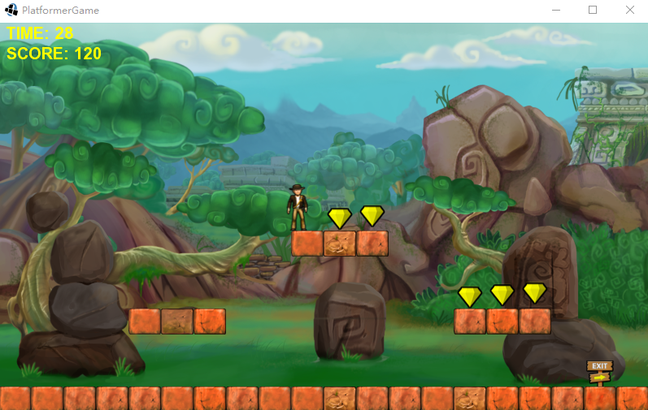

# platformer
1. A Java Libgdx platform jump game cloned from XNA 
2. Animation changed by hero's status.
3. Jump up through the platform.
4. Velocity and gravity should be changed to be controlled by Box2D

